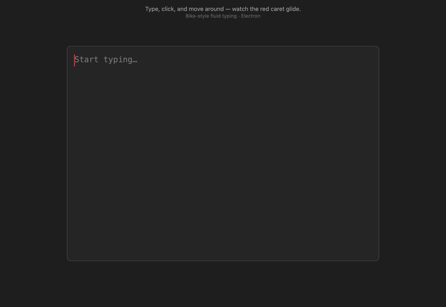

# Virtual Caret — Electron

A native desktop recreation of [apoorv-mishra/virtual-caret](https://github.com/apoorv-mishra/virtual-caret),
inspired by [Bike Outliner's](https://www.hogbaysoftware.com/bike/) fluid-typing feature.

The native text caret is hidden and replaced by a **virtual caret** — a red bar
that *smoothly glides* to each new cursor position as you type, click, or move
around, giving typing that fluid, animated feel.



## Run

```bash
npm install
npm start
```

An Electron window titled "Virtual Caret" opens. Start typing.

## How it works

- The `<textarea>` has `caret-color: transparent`, hiding the OS caret.
- A `#virtual-caret` div is absolutely positioned over the textarea.
- On every input/selection/click event, the caret's target pixel position is
  computed and it **animates** to that spot via the Web Animations API
  (`element.animate`, ~90ms ease-out) — the fluid-typing effect.
- Blinking pauses while the caret is gliding, then resumes.

### Positioning: mirror-div technique

The original computed x/y from a naive character-stream model (chars-per-line ×
char width), which breaks on explicit newlines and word-wrap. This version uses
a hidden **mirror div** that clones the textarea's box + font metrics, holds the
text up to the caret offset, and measures a zero-width marker span's rect. This
correctly handles multi-line text, wrapping, and scrolling.

## Structure

```
main.js               Electron main process (creates the BrowserWindow)
renderer/index.html   UI markup
renderer/styles.css   Textarea + virtual-caret styling
renderer/script.js    Caret positioning + animation logic
```

## License

MIT
